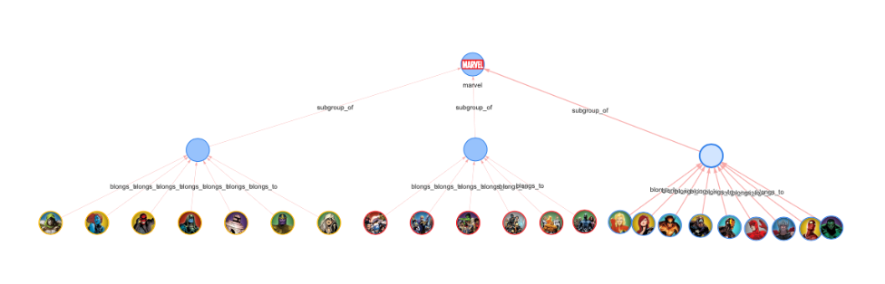

Based on [react-graph-vis](https://github.com/crubier/react-graph-vis)


## Install

`pip install streamlit-agraph`

## Example App 
Check out the example [App](https://marvelous-graph.streamlit.app)!

## Basic Usage
```python
import streamlit
from streamlit_agraph import agraph, Node, Edge, Config

nodes = []
edges = []
nodes.append( Node(id="Spiderman", 
                   label="Peter Parker", 
                   size=25, 
                   shape="circularImage",
                   image="http://marvel-force-chart.surge.sh/marvel_force_chart_img/top_spiderman.png") 
            ) # includes **kwargs
nodes.append( Node(id="Captain_Marvel", 
                   size=25,
                   shape="circularImage",
                   image="http://marvel-force-chart.surge.sh/marvel_force_chart_img/top_captainmarvel.png") 
            )
edges.append( Edge(source="Captain_Marvel", 
                   label="friend_of", 
                   target="Spiderman", 
                   # **kwargs
                   ) 
            ) 

config = Config(width=750,
                height=950,
                directed=True, 
                physics=True, 
                hierarchical=False,
                # **kwargs
                )

return_value = agraph(nodes=nodes, 
                      edges=edges, 
                      config=config)
```
## Config Bilder
```python
from streamlit_agraph.config import Config, ConfigBuilder

# 1. Build the config (with sidebar to play with options) .
config_builder = ConfigBuilder(nodes)
config = config_builder.build()

# 2. If your done, save the config to a file.
config.save("config.json")

# 3. Simple reload from json file (you can bump the builder at this point.)
config = Config(from_json="config.json")
```

Formating the graph with hierachies is also possible via `Hierarchical Option` (see config):  
Group as you can see on the node colors too. Just pass the `group` attribute to the `Node` object.




## TripleStore

You may also want to use the TripleStore (untested & incomplete - yet):  
HINT: Make sure to add only unique nodes and edges.

```python
# Currently not workin since update to agraph 2.0 - work in progress
from rdflib import Graph
from streamlit_agraph import TripleStore, agraph

graph = Graph()
graph.parse("http://www.w3.org/People/Berners-Lee/card")
store = TripleStore()

for subj, pred, obj in graph:
    store.add_triple(subj, pred, obj, "")
    
agraph(list(store.getNodes()), list(store.getEdges()), config)
```

Also graph algos can dirctly supported via the networkx API (untested & incomplete - yet):
```python
from streamlit_agraph import GraphAlgos

algos = GraphAlgos(store)
algos.shortest_path("Spiderman", "Captain_Marvel")
algos.density()
```


